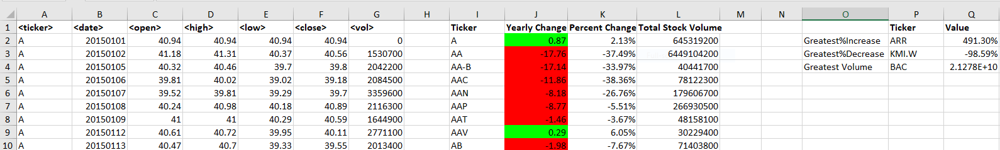
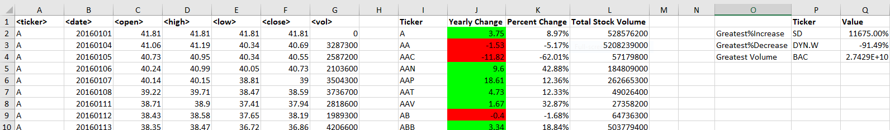

# The VBA of Wall Street Analysis

## Introduction

* Build VBA script to analyze real stock market data [Stock Data](Resources/Multiple_year_stock_data.xlsx).
* Make appropriate adjustments so the VBA script will allow run on every worksheet once we run the script.

## Analysis

* Text VBA code [here](Codes/text_code.txt) and Excel code [here](Codes/excel_code.xlsx)
* Created a script that loops through all the stocks for one year and output the following:
  * The ticker symbol.
  * Yearly change from opening price at the beginning of a given year to the closing price at the end.
  * The percent change from opening price at the beginning of a given year to the closing price at the end.
  * The total stock volume of the stock.
* Included conditional formatting that will highlight positive change in green and negative change in red.
* Calculated Stocks with "Greatest % increase", "Greatest % decrease" and "Greatest total volume".
* Analysis done for each year seperately from 2014 to 2016.

### Screenshots

#### 2014 Analysis          

#### 2015 Analysis
 

#### 2016 Analysis

